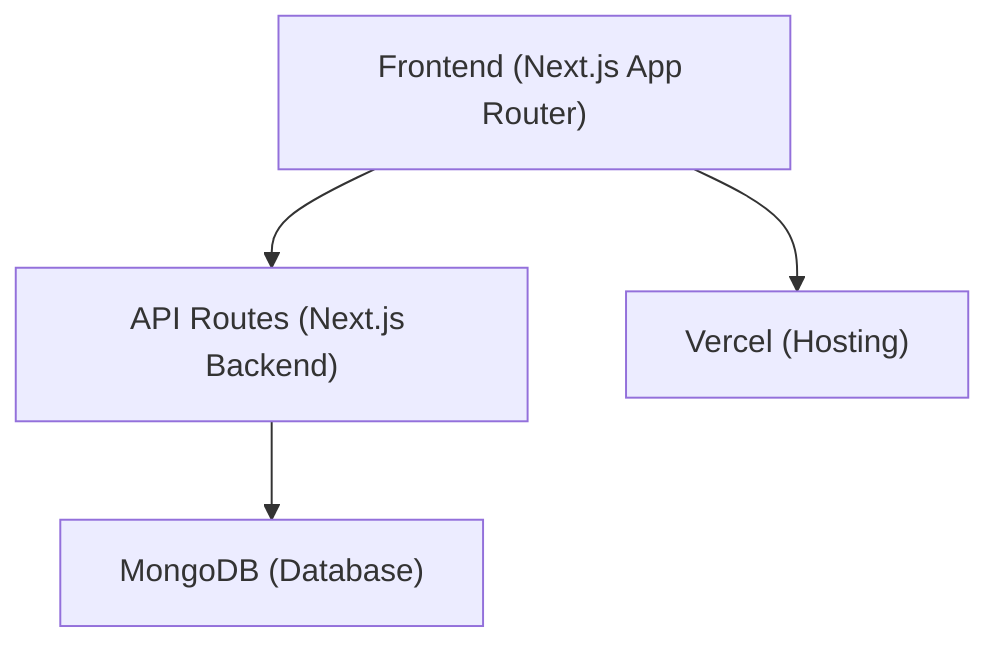
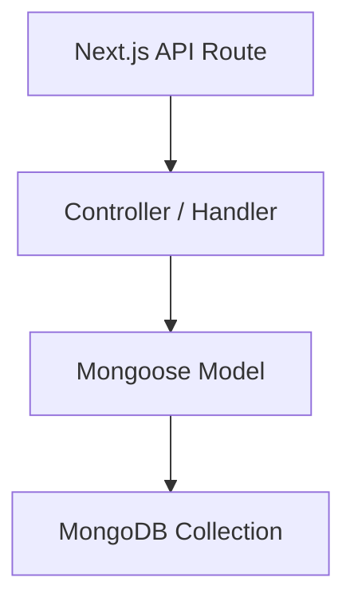
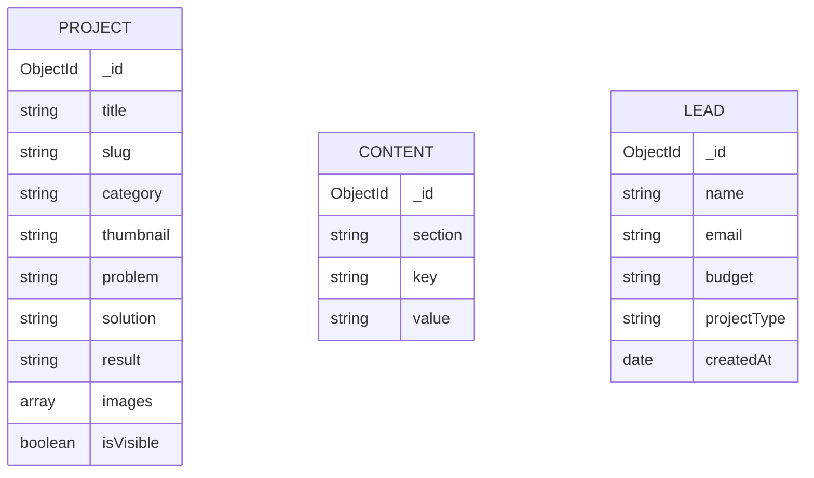

## 1. Architecture Design



## 2. Technology Description
- **Frontend**: Next.js (App Router), React, Tailwind CSS, Framer Motion, GSAP
- **Backend**: Node.js (Next.js API routes)
- **Database**: MongoDB (via Mongoose)
- **Deployment**: Vercel
- **State Management**: React Context / Zustand
- **Authentication**: NextAuth.js (Auth.js)

## 3. Route Definitions
| Route | Purpose |
|-------|---------|
| `/` | Main portfolio landing page |
| `/project/[slug]` | Individual case study page |
| `/admin/login` | Admin authentication page |
| `/admin` | Admin dashboard overview |
| `/admin/projects` | Manage projects |
| `/admin/content` | Manage text and SEO |
| `/admin/leads` | View contact submissions |
| `/api/contact` | Endpoint for contact form |
| `/api/projects` | CRUD endpoint for projects |
| `/api/content` | CRUD endpoint for site content |

## 4. API Definitions
```typescript
interface Project {
  _id: string;
  title: string;
  slug: string;
  category: string;
  thumbnail: string;
  problem: string;
  solution: string;
  result: string;
  images: string[];
}

interface Lead {
  _id: string;
  name: string;
  email: string;
  budget: string;
  projectType: string;
  createdAt: Date;
}
```

## 5. Server Architecture Diagram


## 6. Data Model
### 6.1 Data Model Definition

