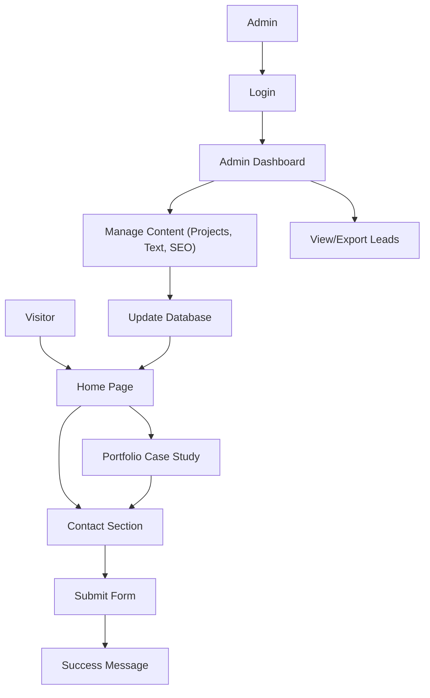

## 1. Product Overview
A high-end, modern, visually striking portfolio website for a branding & graphic designer with a full-featured admin dashboard.
- Aims to impress clients instantly, communicate premium quality, and maximize conversions (booking calls and inquiries).
- Allows the designer to control and edit all content (projects, text, testimonials, services, SEO) without touching code.

## 2. Core Features

### 2.1 User Roles
| Role | Registration Method | Core Permissions |
|------|---------------------|------------------|
| Admin | Pre-configured / Seeded | Full access to CMS/Admin dashboard to manage content |
| Visitor | N/A | Browse portfolio, view services, submit contact form |

### 2.2 Feature Module
1. **Public Site**: Hero section, Portfolio grid & case studies, About section, Services, Testimonials, Contact form.
2. **Admin Dashboard**: Authentication, Project management, Media upload, Content management, Testimonials management, Services management, SEO settings, Contact submissions viewer.

### 2.3 Page Details
| Page Name | Module Name | Feature description |
|-----------|-------------|---------------------|
| Home | Hero | Animated headline, strong CTA, background animation |
| Home | Portfolio | Animated grid, category filters, links to case studies |
| Home | About | Story + timeline animation, skills UI, trust signals |
| Home | Services | Animated cards, clear offers / pricing |
| Home | Testimonials | Interactive carousel |
| Home | Contact | Form (name, email, budget, project type), Calendly integration, success animation |
| Case Study | Project Details | Problem → Solution → Result, Before/after visuals |
| Admin Login | Auth | Secure login for the site owner |
| Admin Dashboard | Overview | Stats, recent form submissions |
| Admin Projects | CRUD | Add, edit, delete portfolio projects and media |
| Admin Content | Text Editor | Edit website text (headlines, descriptions, buttons), SEO |
| Admin Services | CRUD | Manage services and pricing |
| Admin Testimonials | CRUD | Manage testimonials |
| Admin Leads | Viewer | View and export contact form submissions |

## 3. Core Process
Visitor flow and Admin flow for managing content.

## 4. User Interface Design
### 4.1 Design Style
- **Colors**: Minimal, bold, premium. Black/white base + strong accent color (e.g., vibrant orange or electric blue).
- **Typography**: Strong, distinctive typography focus. Sharp display font + refined body font.
- **Style**: Glassmorphism, modern UI feel, smooth micro-interactions.
- **Animations**: Page transitions (smooth, no reload feel), scroll-triggered animations, hover interactions everywhere, premium easing (GSAP/Framer Motion).
- **Extra**: Dark mode toggle, custom cursor, preloader animation, sticky navbar.

### 4.2 Page Design Overview
| Page Name | Module Name | UI Elements |
|-----------|-------------|-------------|
| Home | Hero | Bold typography, background animation, clear CTA buttons |
| Home | Portfolio | Asymmetric grid, hover reveals, category filters |
| Admin | Dashboard | Clean, modern UI, easy to use, sidebar navigation, data tables |

### 4.3 Responsiveness
Desktop-first design, fully responsive down to mobile sizes, touch-optimized interactions for the portfolio grid.
